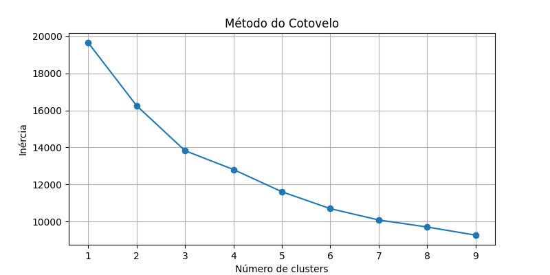
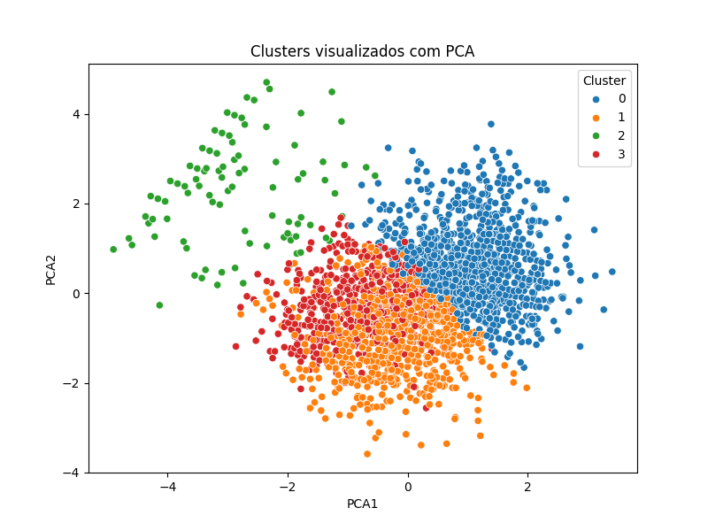
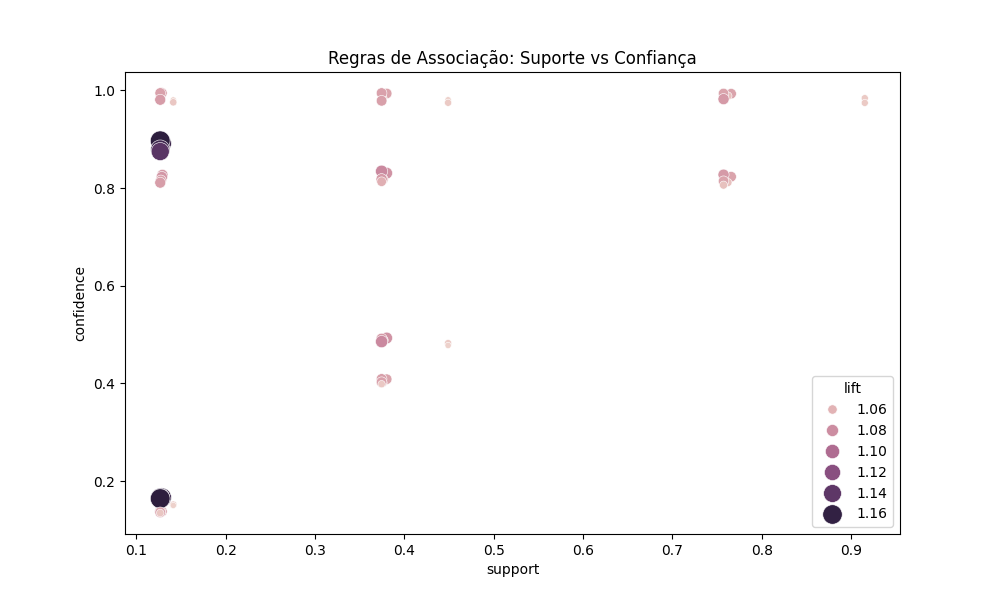

# Data Mining Elective

## Alunos:
- Lucas Willian de Souza Serpa  
- Marlon de Souza

---

## 1. Análise de Anomalias com Clustering

**a. Existe um grupo incomum de passageiros que não se enquadra no perfil típico de cliente do aeroporto?**  
**Resposta:** Sim, foi identificado um grupo incomum de passageiros, representado pelo **Cluster 2**, que representa aproximadamente **5,7%** dos passageiros do aeroporto.

### i. Qual é o tamanho do cluster em percentagem aos passageiros do aeroporto e qual é o perfil do grupo?

- **Tamanho do Cluster:** 5,7% dos passageiros.
- **Perfil do Cluster 2:**
  - **NETPRO (satisfação):** Média de 9,94 (escala de 0 a 11), indicando uma satisfação média-alta.
  - **Idade (Q20Age):** Média de 0,58 (representa uma faixa etária jovem com codificação por faixa).
  - **Gênero (Q21Gender):** Média de 0,21 (indica predominância do gênero masculino).
  - **Renda (Q22Income):** Média de 0,075 (indica baixa renda).
  - **Frequência de voos (Q23FLY):** Média de 0,09 (baixa frequência).
  - **Experiência de voo (Q5TIMESFLOWN):** Média de 2,39 (2 a 3 voos por ano).
  - **Tempo de uso do aeroporto (Q6LONGUSE):** Média de 2,5 anos (uso moderado do SFO).

**Conclusão:**  
O Cluster 2 representa um grupo fora do padrão comum dos demais passageiros. Apesar de sua alta satisfação, tem baixa renda, voa pouco, e representa um público potencial para estratégias específicas de marketing e fidelização.

---

## 2. Regras de Associação

### a. Problema

Analisar como diferentes variáveis demográficas e comportamentais se associam à satisfação e ao comportamento dos passageiros de um aeroporto. As regras de associação ajudam a identificar padrões interessantes nesses dados.

### b. Dados utilizados

- **NETPRO:** Índice de satisfação (Net Promoter Score).
- **Q20Age:** Idade.
- **Q21Gender:** Gênero.
- **Q22Income:** Faixa de renda.
- **Q23FLY:** Frequência de voos.
- **Q5TIMESFLOWN:** Quantidade de voos realizados.
- **Q6LONGUSE:** Tempo de uso do aeroporto.

### c. Passos para geração das regras

1. **Leitura dos dados** com `pandas`.
2. **Limpeza de dados**, removendo valores ausentes.
3. **Codificação de variáveis categóricas** com `LabelEncoder`.
4. **Binarização dos dados** (valores transformados para 0 ou 1 com base em thresholds definidos).
5. **Geração de itemsets frequentes** com o algoritmo **FP-Growth**.
6. **Geração de regras de associação** com métrica de suporte, confiança e lift.

### d. Regras Geradas

| Antecedente               | Consequente               | Suporte  | Confiança | Lift     |
|---------------------------|---------------------------|----------|-----------|----------|
| (Q21Gender)               | (Q23FLY)                  | 91.53%   | 97.42%    | 1.05     |
| (Q23FLY)                  | (Q21Gender)              | 91.53%   | 98.39%    | 1.05     |
| (Q23FLY)                  | (Q22Income)              | 76.57%   | 82.32%    | 1.07     |
| (Q22Income)              | (Q23FLY)                  | 76.57%   | 99.30%    | 1.07     |
| (Q21Gender)              | (Q22Income)              | 76.21%   | 81.13%    | 1.05     |

**Conclusão:**  
As regras revelam padrões úteis, como a forte associação entre gênero e frequência de voos ou entre renda e comportamento de viagem. Tais regras podem ser aplicadas em sistemas de recomendação, estratégias de marketing e personalização de atendimento.

---

## 3. Regressão Logística

### a. Problema

Prever se um passageiro está voando pela primeira vez (classificação). Este tipo de problema é ideal para Regressão Logística, ao contrário da Regressão Linear, que lida com variáveis contínuas.

### b. Dados utilizados

- **Q5FIRSTTIME:** Variável alvo (primeira vez voando ou não).
- **Q21Gender:** Gênero.
- **Q22Income:** Renda.
- **Q20Age:** Idade.
- **Q23FLY:** Frequência de voo.
- **Q5TIMESFLOWN:** Número de voos realizados.

### c. Treinamento do modelo

1. Carregamento e limpeza dos dados.
2. Definição de `Q5FIRSTTIME` como target.
3. Separação em conjunto de treino e teste (70/30).
4. Treinamento com `LogisticRegression` da biblioteca `sklearn`.

### d. Resultado do modelo

- **Acurácia total:** **78,17%**

#### Métricas por classe:

| Classe | Precisão | Recall | F1-Score | Suporte |
|--------|----------|--------|----------|---------|
| 0      | 0.00     | 0.00   | 0.00     | 6       |
| 1      | 0.83     | 0.90   | 0.87     | 654     |
| 2      | 0.52     | 0.37   | 0.43     | 183     |

- **Matriz de confusão** indica que a classe majoritária (1) teve excelente desempenho.
- A classe 0 não foi bem classificada, provavelmente devido ao desequilíbrio (poucas amostras).
- A classe 2 teve desempenho moderado.

**Conclusão:**  
O modelo de Regressão Logística se mostrou eficaz para o problema de previsão de primeira viagem. Apesar do desbalanceamento, a classe principal foi bem prevista, e os resultados justificam o uso desse tipo de regressão em problemas de classificação como esse.

---
